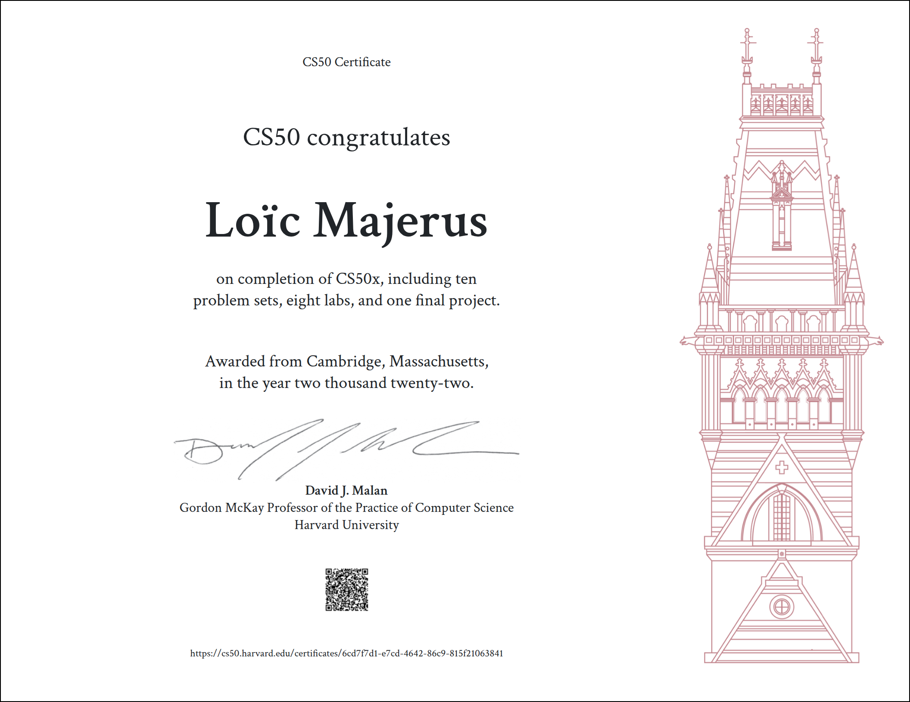

## Certifications

# [CS50x-2022](https://cs50.harvard.edu/x/2022/)

Introduction to the intellectual enterprises of computer science and the art of programming. This course teaches students how to think algorithmically and solve problems efficiently. Topics include abstraction, algorithms, data structures, encapsulation, resource management, security, software engineering, and web programming. Languages include C, Python, and SQL plus HTML, CSS, and JavaScript. Problem sets inspired by the arts, humanities, social sciences, and sciences. Course culminates in a final project. Designed for concentrators and non-concentrators alike, with or without prior programming experience. Two thirds of CS50 students have never taken CS before. Among the overarching goals of this course are to inspire students to explore unfamiliar waters, without fear of failure, create an intensive, shared experience, accessible to all students, and build community among students.

This repository contains my CS50x 2022 Problem set solutions.

You will find the link for each problem set specifications on the _Week_ title above.

## _DISCLAIMER_:

This repository is intended just to share my own solution to the problem sets. Remember that the main goal is to improve your coding abilities, so first try to solve the problems yourself. Copy the code form others is a violation of the [__CS50's Academic Honesty__](https://cs50.harvard.edu/x/2022/honesty/).

### - [Week 0: Scratch](https://cs50.harvard.edu/x/2022/psets/0/scratch/)
* [Problem Set 0](/pset0)

### - [Week 1: C](https://cs50.harvard.edu/x/2022/weeks/1/)

* [Problem Set 1](/pset1)
    - [Hello](/pset1/hello)
    - [Mario More](/pset1/mario2)
    - [Credit](/pset1/credit)

### - [Week 2: Arrays](https://cs50.harvard.edu/x/2022/weeks/2/)

* [Problem Set 2](/pset2)
    - [Readability](/pset2/readability)
    - [Substitution](/pset2/substitution)

### - [Week 3: Algorithms](https://cs50.harvard.edu/x/2022/weeks/3/)

* [Problem Set 3](/pset3)
    - [Plurality](/pset3/plurality)
    - [Runoff](/pset3/runoff)
    - [Tideman](/pset3/tideman)
* [Lab 3](/pset3/lab3)
    - [Sort](/pset3/lab3/sort)

### - [Week 4: Memory](https://cs50.harvard.edu/x/2022/weeks/4/)

* [Problem Set 4](/pset4)
    - [Filter Less](/pset4/less/filter)
    - [Filter More](/pset4/more/filter)
    - [Recover](/pset4/recover)
* [Lab 4](/pset4/lab4)
    - [Volume](/pset4/lab4/volume)

### - [Week 5: Data Structures](https://cs50.harvard.edu/x/2022/weeks/5/)

* [Problem Set 5](/pset5)
    - [Speller](/pset5/speller)
* [Lab 5](/pset5/lab5)
    - [Inheritance](/pset5/lab5/Inheritance)

### - [Week 6: Python](https://cs50.harvard.edu/x/2022/weeks/6/)

* [Problem Set 6](/pset6)
    - [Hello](/pset6/hello)
    - [Mario More](/pset6/mario/more)
    - [Credit](/pset6/credit)
    - [Readability](/pset6/readability)
    - [DNA](/pset6/dna)
* [Lab 6](/pset6/lab6)
    - [World-cup](/pset6/lab6/world-cup)

### - [Week 7: SQL](https://cs50.harvard.edu/x/2022/weeks/7/)

* [Problem Set 7](/pset7)
    - [Fiftyville](/pset7/fiftyville)
    - [Movies](/pset7/movies)
* [Lab 7](/pset7/lab7)
    - [Songs](/pset7/lab7/songs)

### - [Week 8 HTML, CSS, JavaScript](https://cs50.harvard.edu/x/2022/weeks/8/)

* [Problem Set 8](/pset8)
    - [Homepage](/pset8/homepage)
* [Lab 8](/pset8/lab8)
    - [Trivia](/pset8/lab8/trivia)
 
### - [Week 9 Flask](https://cs50.harvard.edu/x/2022/weeks/9/)

* [Problem Set 9](/pset9)
    - [Finance](/pset9/finance)
* [Lab 9](/pset9/lab9)
    - [Birthdays](/pset9/lab9/birthdays)
    
### - [Week 10 Emoji](https://cs50.harvard.edu/x/2022/weeks/10/)

### - [Final Project](https://cs50.harvard.edu/x/2022/project/)

* [Minishell](/project)

### - [CS50 Certificate](https://github.com/Kinglo25/CS50x/blob/main/certificate/CS50x.pdf)
